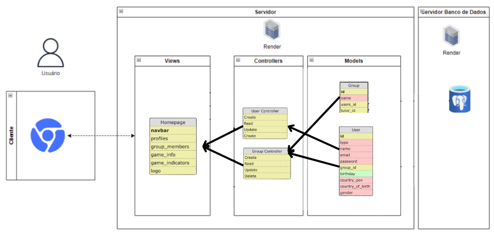

# Exemplo de Design de Arquitetura

# Template Readme para Arquitetura MVC em Markdown

- Nome do Projeto: [MVC Website Zyd]
- Descrição: Uma plataforma interativa para estudantes gerenciarem suas tarefas relacionadas a um desafio de negócios.
- Arquitetura: MVC (Model-View-Controller)
- Ferramenta de Diagramação: Canva e modelagem de banco de dados

## Modelos (Models):

- **Grupo (Group):**
  - `id`: Identificador único do grupo.
  - `nome`: Nome do grupo.
  - `users_id`: Identificador dos usuários membros do grupo.
  - `tutor_id`: Identificador do tutor do grupo.
- **Usuário (User):**

  - `id`: Identificador único do usuário.
  - `tipo`: Tipo de usuário (admin, membro).
  - `nome`: Nome do usuário.
  - `email`: E-mail do usuário.
  - `senha`: Senha de acesso do usuário.
  - `group_id`: Identificador do grupo ao qual pertence.
  - `birthday`: Data de nascimento do usuário.
  - `country_of_birth`: País de nascimento do usuário.
  - `gender`: Gênero do usuário.

- Relacionamento entre entidades:
  - Um `Group` pode ter vários `Users`, mas um `User` pertence a apenas um `Group`.
  - Um `User` pode ser um `Tutor` para um `Group`, mas um `Group` tem apenas um `Tutor`.

## Controladores (Controllers):

- **UserController:**
  - `Create`: Cria um novo usuário. Parâmetros: tipo, nome, email, senha, group_id, birthday, country_of_birth, gender.
  - `Read`: Lê informações de um usuário. Parâmetros: id.
  - `Update`: Atualiza informações de um usuário. Parâmetros: id, campos para atualizar.
  - `Delete`: Exclui um usuário. Parâmetros: id.
- **GroupController:**

  - `Create`: Cria um novo grupo. Parâmetros: nome, users_id, tutor_id.
  - `Read`: Lê informações de um grupo. Parâmetros: id.
  - `Update`: Atualiza informações de um grupo. Parâmetros: id, campos para atualizar.
  - `Delete`: Exclui um grupo. Parâmetros: id.

- Interação entre controllers e models:
  - `UserController` interage com o modelo `User`, gerenciando a criação, leitura, atualização e exclusão de usuários.
  - `GroupController` interage com o modelo `Group`, realizando operações semelhantes para grupos.

## Views (Views):

- **Homepage**: Página inicial que exibe a barra de navegação, perfis, membros do grupo, informações e indicadores do cesim game, e o logo do site.
  - `navbar`: Barra de navegação do site.
  - `profiles`: Perfil dos usuários.
  - `group_members`: Membros dos grupos.
  - `game_info`: Informações sobre o jogo.
  - `game_indicators`: Indicadores de performance no jogo.
  - `logo`: Logotipo do site.

## Infraestrutura:

- Servidor web para hospedar a aplicação.
- Banco de dados para armazenamento de dados de `User` e `Group`.
- APIs externas para integração com serviços do cesim e autenticação de usuários.

- Integração da infraestrutura com MVC:
  - O servidor web processa as requisições, utiliza os `Controllers` para manipular os dados nos `Models`, e renderiza as `Views` para o usuário.

## Justifique as escolhas feitas e como elas impactam o projeto

### Implicações da Arquitetura:

- A arquitetura MVC facilita a escalabilidade, pois separa claramente as responsabilidades de cada parte da aplicação.
- Manutenção e testabilidade são melhoradas, já que cada componente pode ser desenvolvido e testado de forma independente.
- Mudanças no design da interface (`Views`) podem ser feitas sem afetar a lógica de negócio (`Models` e `Controllers`).

A arquitetura escolhida suporta um desenvolvimento ágil e iterativo, permitindo que a equipe responda rapidamente a mudanças no ambiente de um desafio de negócios, que é muito dinâmico.

### Recursos Adicionais:

- Documentação do Sails.js: https://github.com/balderdashy/sails
- Tutorial do draw.io: https://m.youtube.com/watch?v=w3zm-wbmlpc
- Exemplos de diagramas MVC: https://www.lucidchart.com/pages/templates
